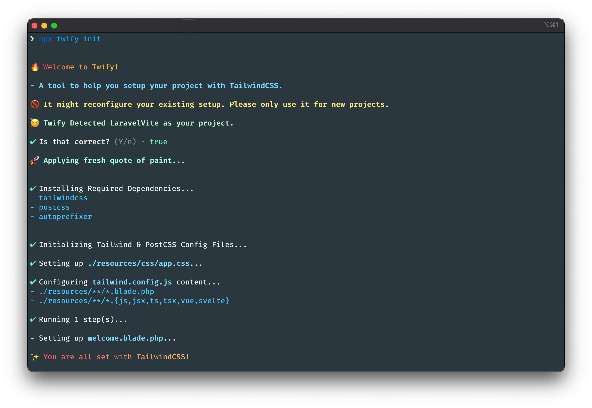

# :unicorn: Twify


[](https://www.npmjs.com/package/twify)
[](https://www.npmjs.com/package/twify)


A simple tool to setup [Tailwind CSS](https://tailwindcss.com/) in your fresh project with a Single Command.

## :fire: How It Works

Here is a screen grab of how it looks.



## :gift: Installation

Scaffold a new project of your choice then simply run,

```sh
npx twify init
```

## :star: Supported Projects

Below are the list of Supported Projects,

| **Framework**    | **Javascript**     | **Typescript**     |
|------------------|--------------------|--------------------|
| Next JS          | :white_check_mark: | :white_check_mark: |
| Remix            | :white_check_mark: | :white_check_mark: |
| Nuxt 2           | :white_check_mark: | :white_check_mark: |
| Nuxt 3           | :white_check_mark: | :white_check_mark: |
| Svelte Kit       | :white_check_mark: | :white_check_mark: |
| Laravel Vite     | :white_check_mark: | :white_check_mark: |
| Vite             | :white_check_mark: | :white_check_mark: |
| Angular          | :white_check_mark: | :white_check_mark: |
| Create React App | :white_check_mark: | :white_check_mark: |
| Gatsby           | :o: WIP            | :o: WIP            |


## :microscope: Testing

After Cloning the repository, install all npm dependencies by running: `npm install`.

Then Run Tests:

```bash
$ npm run test
$ npm run coverage
```

## :date: Change log

Please see [release history][link-releases] for more information on what has changed recently.

## :heart: Contributing

Please feel free to contribute ideas and PRs are most welcome.

## :crown: Credits

- [Kazi Mainuddin Ahmed][link-author]
- [All Contributors][link-contributors]

## :policeman: License

The MIT License (MIT). Please see [License File](LICENSE.md) for more information.

[link-author]: https://github.com/tzsk
[link-contributors]: ../../contributors
[link-releases]: ../../releases
